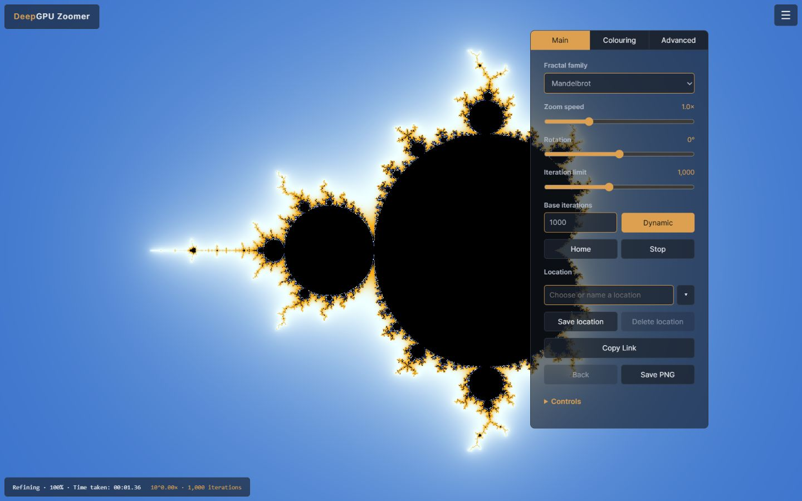
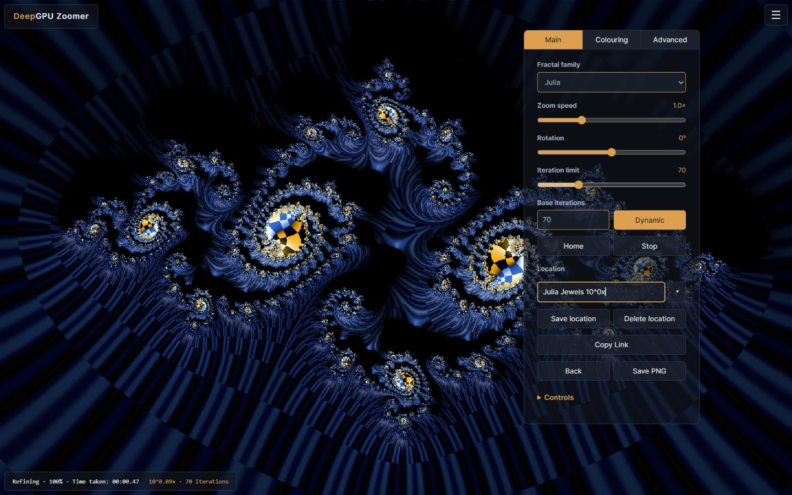
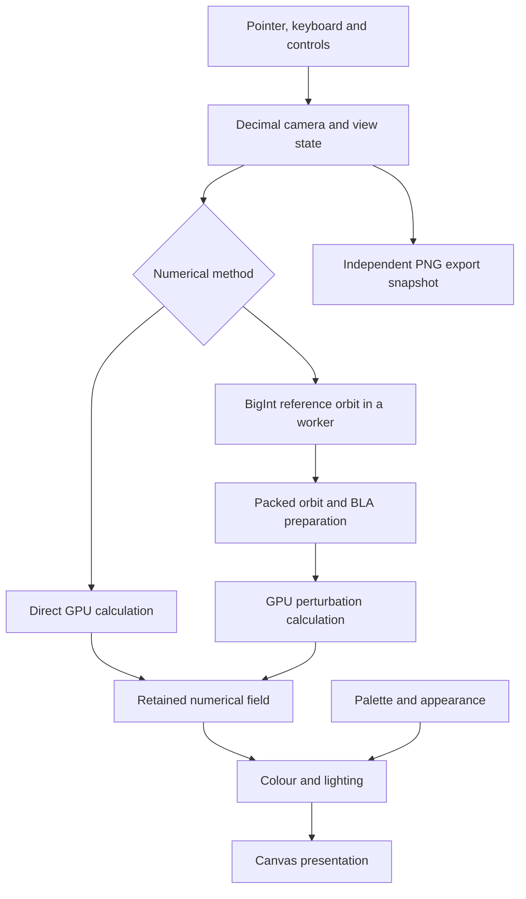

<div align="center">

# DeepGPU Zoomer

**The fastest, deepest and smoothest WebGPU Fractal Zoomer in the world! (probably)... Explore Mandelbrot and Julia sets in real-time - in your browser - to depths of 10^-400 and beyond.**

[](https://www.w3.org/TR/webgpu/) [](https://www.typescriptlang.org/) [](https://www.w3.org/TR/WGSL/) [](#introduction) [](LICENSE)

[Open the app](https://byronbuzz.github.io/DeepGPU-Zoomer/) · [Get started](#get-started) · [Controls](#explore) · [Advanced](#advanced) · [References](#references) · [Acknowledgements](#acknowledgements)

</div>



<a id="introduction"></a>

## ✨ Introduction

Dive into a dazzling universe of Mandelbrot and Julia fractals, where every zoom reveals another world of spirals, filaments and miniature sets. Put your GPU to work and follow your curiosity into extraordinary depths, right in your browser. Steer, pan and rotate through the detail, bring it alive with colour and lighting, then capture your discoveries as exact view links or high-resolution PNGs.

WebGPU handles parallel pixel calculation and presentation. At deeper scales, an arbitrary-precision reference orbit runs in a background worker, while GPU perturbation methods calculate the surrounding detail. Coordinates retain their decimal digits throughout navigation and saved views.

| 🔭 Explore | 🎨 Make it yours | 💾 Keep the view |
| --- | --- | --- |
| Mandelbrot and quadratic Julia sets | Editable gradients with 2–8 colour stops | Named locations stored in your browser |
| Pointer-directed zoom, pan and rotation | 25 colour formulas and 20 optional effects | Exact links with coordinates and appearance |
| Live Julia preview and 12 editable default locations | Lighting, hue rotation and capped-point patterns | Tiled PNG export at custom resolutions |
| Progressive detail and optional 2× oversampling | Movable controls and a custom panel accent | Your own saved startup preferences |

The application runs locally on your computer. It has no account system, rendering server or cloud-compute dependency.

<a id="get-started"></a>

## 🚀 Get started

**[Open DeepGPU Zoomer](https://byronbuzz.github.io/DeepGPU-Zoomer/)** in a browser with WebGPU support. No installation is needed to use the hosted app. Browser, GPU, operating-system and driver support all matter. See [WebGPU availability](https://developer.mozilla.org/en-US/docs/Web/API/WebGPU_API).

To run the source locally, you need Node.js and npm. Use a secure page origin: the local development address below works; hosted installations should use HTTPS.

```sh
git clone https://github.com/byronbuzz/DeepGPU-Zoomer.git
cd DeepGPU-Zoomer
npm ci
npm run dev
```

Open **[http://127.0.0.1:5183](http://127.0.0.1:5183)**. The development server uses a fixed port and reports an error if that port is already occupied.

To produce the static application:

```sh
npm run build
npm run preview
```

The build writes to `dist/`; the preview command prints its local address. A deployed build needs only static hosting with HTTPS. Visitors need no Node.js installation or native helper. There is no alternative rendering backend when WebGPU is unavailable.

GitHub Pages is published by [the deployment workflow](.github/workflows/pages.yml), which installs the locked dependencies, checks TypeScript, and builds with `--base=/DeepGPU-Zoomer/` so scripts, styles and the reference worker load beneath the repository URL. It runs after a push to `main` or a manual **Deploy GitHub Pages** workflow run. Normal local builds keep the root path.

<a id="explore"></a>

## 🧭 Explore

Start with **Julia Jewels 10^0x** in the Location chooser, or hold the left mouse button over an interesting part of the whole Mandelbrot set. Release to let the view finish refining.

| Action | Control |
| --- | --- |
| Zoom in / out | Hold left / right mouse button; wheel; hold `+` / `−` |
| Pan | `Shift`-drag, middle-button drag, or arrow keys |
| Rotate | `Ctrl`-drag, hold `Ctrl` + Left/Right, or use the Rotation slider |
| Stop movement | `Esc` |
| Stop calculation and retain the image | **Stop** |
| Show / hide controls | Menu button or `Tab` while focused on the fractal |
| Fullscreen | `F11`; `Esc` or `F11` exits |
| Open / close Julia preview | `J` |
| Open the selected Julia / return to Mandelbrot | `M` |

Keyboard navigation applies when you are interacting with the canvas rather than typing into a field. While Julia preview is open over Mandelbrot, left-click or left-drag selects the Julia constant instead of zooming in. The preview follows the main iteration limit; **M** opens the latest selection and preserves the Mandelbrot view for your return.

### Main controls

- **Iteration limit** sets the current calculation limit, from **1 to 10,000,000**. Higher limits can reveal more detail around difficult boundaries, at a greater computation cost.
- **Base iterations** sets the starting limit for Dynamic adjustment. **Dynamic** raises or lowers the effective limit during zooming according to depth. Turn it off to keep a fixed limit.
- **Home** returns to the whole view of the current family. **Full Reset** in Advanced restores factory preferences and Mandelbrot Home, while retaining saved locations.
- **Location** searches your saved views, including 12 defaults added once from the supplied collection. All entries are editable and deletable; deleted defaults stay deleted after reload. Enter a name and choose **Save location**. Saving the selected location updates it; a collision with another saved name asks before replacement. **Delete location** asks “Delete saved location?” and keeps the current view. **Back** restores the exact view before your last location jump, including Home or a family change; its history lasts for this session.
- **Copy Link** includes the camera, Julia constant, camera rotation, iteration limit, appearance, colour rotation checkbox states, reverse direction and speed. Saved locations preserve the same settings. Paste the link into the browser address bar and press Enter to open that exact location immediately, including in an already open explorer.
- **Backup locations** and **Restore locations** in Advanced export and import JSON. Restore preserves existing entries, skips duplicates, and renames conflicting incoming names to keep both versions. Keep a backup before moving to another hostname, port or browser profile; browser storage is separate for each origin.
- **Save defaults**, beneath the location backup/restore buttons in Advanced, stores your preferred appearance, controls, iteration settings and panel settings. Startup uses the Home camera unless an exact link is opened.

### Colour and detail

The **Colouring** tab offers colour formulas, effects, capped-point patterns, colour spacing, Palette Offset, Hue Offset and lighting. Expand **Edit Palette** to choose a preset or edit individual stops with the 2D swatch, hue and hex picker, including an eyedropper with a magnified pixel preview for sampling the image. Drag stops, add or remove them, lock selected colours during randomisation, reverse stops, space them evenly, and undo or redo edits. Palette Offset and Light Direction each have a **rotate** checkbox; Advanced's **Rotation speed** ranges from 1 second to 1 minute per light rotation (default 10 seconds). Palette rotation takes four times as long, from 4 seconds to 4 minutes per cycle. Move the speed slider right for faster rotation; Reverse direction reverses both rotations.

The **Advanced** tab keeps the main detail controls together:

| Control | What it changes | Factory setting |
| --- | --- | --- |
| Throughput | Work scheduling during navigation: Smooth, Balanced or Detailed | **Smooth** |
| Pointer priority | Relative attention to the pointer area while other regions also receive work | **4×** |
| 2× Pointer refinement | Additional local detail around the pointer during interaction | **Off** |
| 2× oversampling | A stationary image calculated at twice the width and height, then resolved for display | **Off** |
| BLA precision | Mandelbrot approximation tolerance; a larger displayed exponent is stricter | **2¹⁴** |
| Dynamic gain | Requested iteration increase per tenfold zoom from the current anchor | **5,000** |

**When movement stops, refinement automatically uses Detailed throughput.** Your selected throughput remains the preference for navigation. Factory settings are **1×** zoom, Mandelbrot Home, **1,000 iterations** and **Dynamic enabled**. Saved defaults and remembered local preferences may override those settings; startup still uses the Home camera.

Move the controls by dragging their background or tab headers and resize their width from the side edges. Each tab fits its content, scrolling when it reaches the bottom margin of the viewport. Main’s **Controls** accordion contains the keyboard and mouse guide. Advanced also contains panel opacity, accent colour and **menu hides title and status line**. That option hides both with the menu when checked; both remain visible when unchecked.

The factory accent is **#e5a14e** and panel opacity is **60%**. Control backgrounds use 1.2 times the panel opacity, capped at 100%; active tabs, active buttons, pressed states and hover backgrounds are fully opaque. The menu icon stays white. PNG export and Julia preview move independently: opening one while the other is visible places it underneath when space permits, otherwise it is centred.

### Save a PNG

Choose **Save PNG** in Main, then select Current viewport, Display estimate, a 2×–4× display estimate, or enter custom dimensions. Display estimates use browser-reported screen dimensions and pixel ratio without requesting permissions; browser zoom can affect the estimate.

Export captures the view when you press Save PNG and renders independently of subsequent navigation. It preserves the centre, rotation and vertical span; changing the aspect ratio crops or extends the horizontal field. You can cancel an export. Output is limited to **80 million pixels** and **32,768 pixels per dimension**, with additional memory and GPU-capacity checks.

For the complete control reference, defaults and troubleshooting, see the **[User guide](docs/user-guide.md)**.



*Julia Jewels, one of the editable default locations. Both images above are captured from the current application.*

<a id="advanced"></a>

## 🔬 Advanced: how it works

### Technologies and architecture

The interface uses TypeScript, HTML and CSS without a UI framework. Vite bundles the application and imports WGSL shader sources. [decimal.js](https://mikemcl.github.io/decimal.js/) provides arbitrary-precision decimal camera arithmetic. Native `BigInt` arithmetic drives reference-orbit calculation in a dedicated Web Worker. WebGPU compute pipelines evaluate and shade pixels; render pipelines present them.

| Component | Role |
| --- | --- |
| `src/main.ts` | Input, application state, render scheduling, Julia preview and preferences |
| `src/state.ts`, `src/coordinate.ts`, `src/rotation.ts` | Decimal camera, exact view serialization, coordinate preparation and rotation |
| `src/render/reference-*.ts` | Background reference generation, packing, transfer and GPU preparation |
| `src/render/webgpu-renderer.ts` | Numerical method selection, GPU resources, retained fields and publication |
| `src/render/*.wgsl`, `src/arithmetic/` | Pixel recurrences, compensated arithmetic, field reuse and shading |
| `src/render/bla.ts` | Hierarchical bivariate linear approximation |
| `src/render/regions.ts`, `src/render/*grid.ts` | Pending work, coverage and coordinate-preserving sample reuse |
| `src/gpu/` | Device acquisition, capacity checks, shader compilation and timing |
| `src/palette-editor.ts`, `src/panels.ts`, `src/tuning.ts` | Appearance editing, movable panels and navigation policies |
| `src/colour-picker.ts`, `src/colour-rotation.ts` | Shared colour pickers, image-sampling loupe and timed palette/light rotation |
| `src/locations.ts`, `src/default-locations.json`, `src/defaults.ts` | Location backup/restore, the default collection and saved startup preferences |
| `src/export/` | Export snapshots, tile planning, readback and PNG encoding |

The current dependency versions are decimal.js **10.6.0**, TypeScript **5.9.3**, Vite **5.4.21** and WebGPU type definitions **0.1.71**. The [lockfile](package-lock.json) records the complete dependency resolution.



See the **[Architecture reference](docs/architecture.md)** for the active data flow, source map and implementation boundaries.

### The fractal calculation

Both families use the quadratic recurrence:

$$z_{n+1}=z_n^2+c$$

For Mandelbrot, each pixel supplies $c$ and starts with $z_0=0$. For Julia, every pixel shares the selected $c$, and the pixel coordinate supplies $z_0$.

At shallow scales, a Direct GPU path calculates each orbit using compensated floating-point arithmetic. At deeper scales, the renderer first calculates one high-precision reference trajectory $Z_n$. Nearby pixels follow a smaller displacement $\delta z_n$:

$$\delta z_{n+1}=2Z_n\delta z_n+(\delta z_n)^2+\delta c$$

For Mandelbrot, $\delta c$ varies by pixel. For Julia, the initial displacement varies and $\delta c=0$. This avoids repeating a full arbitrary-precision orbit for every pixel.

### Precision, range and rebasing

The reference worker uses fixed-point `BigInt` arithmetic with profiles of **8, 16, 32, 64, 128 or 256 32-bit limbs**, selected from the scale. Reference generation arrives in resumable chunks; a higher iteration demand can extend a compatible reference from its retained arithmetic state.

GPU deltas use compensated `f32` components and explicit exponents. The deep Wide path uses four components for each real and imaginary part, plus a shared exponent, so very small offsets do not disappear at the ordinary `f32` exponent floor. Julia also uses Wide arithmetic on its direct route.

Rebasing changes the reference-relative representation when the evolving pixel orbit is better expressed closer to the reference origin. Julia uses its own relative initialization and encoding so small separations can survive subtraction from much larger coordinates.

These mechanisms support very deep exploration, but do not imply unlimited precision or mathematical certification. The active profiles, requested iteration count, browser memory and device limits remain finite. Saved-view validation allows decimal spans down to the current profile envelope; actual renderability also depends on pixel scale and orbit requirements.

### Bivariate linear approximation (BLA)

BLA accelerates eligible stretches of a reference trajectory by approximating several perturbation iterations together:

$$\delta z_{n+\ell}\approx A_{n,\ell}\delta z_n+B_{n,\ell}\delta c$$

The implementation composes adjacent steps into a hierarchy of coefficients and validity radii. The GPU takes a skip only when the local radius admits it, and evaluates the full recurrence when a skip is unavailable. The shader also retains escape and rebasing logic around the accelerated path.

**BLA precision** adjusts the local tolerance for Mandelbrot: the displayed range **2¹⁴–2²⁴** corresponds to tolerances **2⁻¹⁴–2⁻²⁴**. A larger displayed value is stricter and may reduce available skips. It does not change the camera's decimal precision or the reference limb count. Eligible Julia rendering uses a separate fixed policy.

This is a local approximation criterion, not an interval-arithmetic proof or a guaranteed global image-error bound. Likewise, a pixel that reaches its iteration cap has not necessarily been proved to belong to the set.

### Reuse, progressive detail and responsive navigation

Several mechanisms work together to keep useful pixels on screen:

- **Coordinate-preserving sample reuse.** Previously calculated values can move into a compatible new field when their sample coordinates match. Numerical identity includes the settings needed to interpret those values correctly.
- **Reprojection for presentation.** A completed image can be transformed into the moving camera while replacement samples arrive. This temporary presentation is distinct from calculating a new sample.
- **Pending-region scheduling.** Rectangular work regions balance pointer attention, distributed coverage and older pending work. Uncovered gaps are progressively filled instead of repeatedly replacing the whole image.
- **Measured batch sizes.** Available GPU timestamps and completion feedback inform work sizing. Navigation throughput chooses a scheduling policy; stationary refinement uses Detailed.
- **Overscan and retained coverage.** Samples outside the visible area can help with motion and rotated views, subject to bounded field sizes. Rotated views can reuse displayed imagery, but exact numerical-grid remapping is restricted to unrotated grids.
- **Reference and iteration reuse.** Compatible reference trajectories can be extended, while already escaped samples can remain useful across eligible changes in the iteration cap.
- **Bounded continuation.** Expensive cold work can advance in bounded portions while retaining its orbit state between submissions.
- **Coherent publication.** A published image is paired with its camera, dimensions and appearance metadata before the renderer yields, so subsequent presentation knows which view it is showing.

Responsiveness and convergence depend on the scene, resolution, iteration demand and device. Throughput labels are preferences rather than frame-rate guarantees.

### Appearance without unnecessary orbit work

The numerical field and its colour presentation are separate. Palette changes, hue rotation and many scalar-based formulas can recolour retained values. Formulas that need the final orbit endpoint request the additional channels when required. Distance lighting additionally propagates derivative information, so enabling it can require fresh numerical work.

The palette editor provides repeating gradients with **2–8 stops**. Presets include sampled Matplotlib colormaps; colour formulas include smooth escape, iteration bands, decomposition, endpoint-based mappings and scalar patterns. Effects modify colour or relief. Capped-point patterns use the final available orbit data and are artistic representations, not classifications of proven interior points.

**2× oversampling** is a separate stationary quality stage: twice the width and height means four spatial samples per displayed pixel, resolved back to the screen. **2× Pointer refinement** concentrates detail locally during interaction. Oversampling increases final sample count; pointer refinement advances local detail more aggressively.

### PNG export and local state

Large images are rendered in bounded, padded tiles assembled into scanline strips. Padding supplies neighbouring samples where the appearance needs them. A streaming PNG encoder consumes the strips, avoiding a single full-size GPU target. The export captures its own camera and appearance, supports cancellation, and checks both device limits and an export memory budget. A matching completed oversampled image may be reused when available.

Locations, appearance and preferences are stored in browser-local storage. Exact links serialize decimal coordinate strings in the URL fragment. A link preserves the view and appearance, while device-local navigation and panel preferences remain local. Ordinary startup uses Home; pasted location links open their views immediately.

There is no application analytics client, remote rendering call or automatic upload of saved locations or PNGs. Sharing a copied link is your choice. Browser storage belongs to the origin and browser profile, so clearing it removes locally saved preferences and locations.

<a id="references"></a>

## 📚 References

### Fractal methods and implementations

- **[Claude Heiland-Allen: Deep zoom theory and practice](https://mathr.co.uk/web/deep-zoom.html)** — perturbation, rebasing, BLA and links to the original research and discussions.
- **[K. I. Martin: SuperFractalThing Maths, linked in mathr's overview](https://mathr.co.uk/blog/2021-05-14_deep_zoom_theory_and_practice.html)** — the perturbation method for deep Mandelbrot zooms, with a link to the archived paper.
- **[Zhuoran: Another solution to perturbation glitches](https://web.archive.org/web/20230125202704/https://fractalforums.org/f/28/t/4360)** — the original rebasing discussion and pseudocode.
- **[mandelbrot-webgpu](https://github.com/Desarso/mandelbrot-webgpu)** — the principal upstream foundation for the arithmetic and rendering implementation.
- **[FractalShark](https://github.com/mattsaccount364/FractalShark)** — high-performance deep-zoom rendering and the architecture credited by the upstream project.
- **[FractalFlow](https://github.com/Timmor77/FractalFlow)** — Julia reference-relative representation and rebasing techniques.
- **[XaoS](https://github.com/xaos-project/XaoS), [XaoSjs](https://github.com/xaos-project/XaoSjs) and the [XaoS Developer Guide](https://github.com/xaos-project/XaoS/wiki/Developer%27s-Guide#dynamic-resolution)** — interactive sample reuse, dynamic resolution and colouring ideas.
- **[QD](https://github.com/BL-highprecision/QD) and [Hida, Li and Bailey's arithmetic paper](https://www.davidhbailey.com/dhbpapers/quad-double.pdf)** — multi-component arithmetic algorithms adapted to `f32` components for the Wide GPU path.

### Browser platform, tools and colour

- **[WebGPU specification](https://www.w3.org/TR/webgpu/), [WGSL specification](https://www.w3.org/TR/WGSL/) and [MDN WebGPU guide](https://developer.mozilla.org/en-US/docs/Web/API/WebGPU_API)** — GPU computation, shading and browser requirements.
- **[Web Workers](https://developer.mozilla.org/en-US/docs/Web/API/Web_Workers_API)** — background reference computation.
- **[decimal.js](https://mikemcl.github.io/decimal.js/), [TypeScript](https://www.typescriptlang.org/), [Vite 5 documentation](https://v5.vite.dev/guide/) and [WebGPU types](https://github.com/gpuweb/types)** — application dependencies and build tooling.
- **[Matplotlib 3.10.6 colormaps](https://matplotlib.org/3.10.6/users/explain/colors/colormaps.html)** — the source of the sampled scientific colour presets.
- **[PNG specification](https://www.w3.org/TR/png-3/) and [Compression Streams](https://developer.mozilla.org/en-US/docs/Web/API/Compression_Streams_API)** — the image format and browser compression used for export.

<a id="acknowledgements"></a>

## 💛 Acknowledgements

DeepGPU Zoomer builds on openly shared fractal mathematics, rendering techniques and software. Thank you to the authors and maintainers whose work made it possible.

Thank you to **[Desarso](https://github.com/Desarso/mandelbrot-webgpu)** for publishing mandelbrot-webgpu, and to **[Matt Renzelmann and the FractalShark contributors](https://github.com/mattsaccount364/FractalShark)** for the deep-zoom architecture credited by that upstream project.

Thank you to **K. I. Martin** for perturbation, **Zhuoran** for rebasing and bilinear-approximation work, and **[Claude Heiland-Allen](https://mathr.co.uk/web/deep-zoom.html)** for the explanations and research resources that make these methods accessible. Thanks also to **[Timofei Amosov](https://github.com/Timmor77/FractalFlow)** for FractalFlow and its Julia rendering techniques.

We are grateful to **Jan Hubička, Thomas Marsh, and the [XaoS](https://github.com/xaos-project/XaoS) and [XaoSjs](https://github.com/xaos-project/XaoSjs) contributors** for interactive zooming and colouring ideas; to **Yozo Hida, Xiaoye S. Li, David H. Bailey and the [QD contributors](https://github.com/BL-highprecision/QD)** for multi-component arithmetic; and to the **[Matplotlib contributors and colormap authors](https://matplotlib.org/3.10.6/users/explain/colors/colormaps.html)** for the colour resources.

Finally, thank you to the **decimal.js, TypeScript, Vite, WebGPU and browser communities** for the tools and platform that make this application possible.

DeepGPU Zoomer is licensed under **[GPL-3.0-or-later](LICENSE)**. Detailed adaptation provenance, source revisions and third-party licensing are recorded in **[NOTICE.md](NOTICE.md)** and **[licenses/](licenses/)**.
